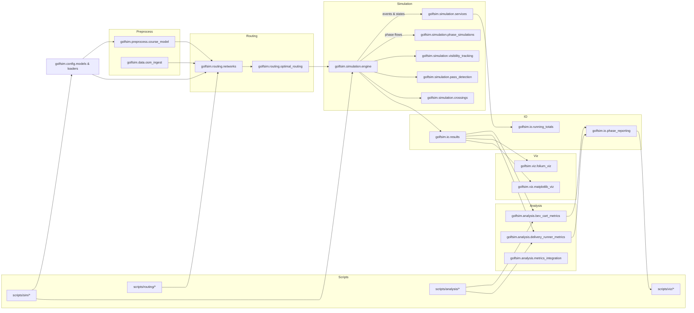

## Project architecture

### Purpose and scope

This document explains how the project is structured, how the main components interact, and the strategy for organizing code as the system evolves. It aims to make it easy to add new courses, simulation phases, routing strategies, and analytics while keeping the codebase maintainable and testable.

### Guiding principles

- **Separation of concerns**: Clear boundaries between preprocessing, routing, simulation, analysis, I/O, and visualization.
- **Pure core, impure edges**: Keep domain logic deterministic; isolate file system, CLI, and plotting at the edges.
- **Configuration-driven**: All runs should be reproducible using versioned JSON configs.
- **Script ergonomics**: Scripts are thin entrypoints that validate input, load configs, initialize logging, and delegate to library code.
- **Test-first interfaces**: Public functions have small, typed interfaces and are covered by unit/integration tests.
- **Extensibility**: New courses, agents, or metrics slot into well-defined extension points without cross-cutting changes.

### High-level architecture

### Directory strategy and responsibilities

- **`golfsim/config`**: Typed configuration models and loaders. JSON schemas are stabilized here to keep scripts simple.
- **`golfsim/data`**: Data ingestion (e.g., OSM). Converts raw geodata into normalized internal forms.
- **`golfsim/preprocess`**: Course building and transformation into domain-ready structures (nodes, edges, segments, geofences).
- **`golfsim/routing`**: Network construction and routing algorithms. No file I/O; deterministic, unit-tested.
- **`golfsim/simulation`**: Core discrete-event simulation engine, services, and phase orchestration. Pure logic with injected dependencies.
- **`golfsim/analysis`**: Metrics computation from simulation outputs; produces structured summaries for downstream reporting.
- **`golfsim/io`**: Reading/writing results, running totals, and phase summaries. Centralizes file formats and paths.
- **`golfsim/viz`**: Optional visualizations. Reads from files produced by `golfsim.io` or directly from in-memory results in scripts.
- **`scripts/`**: Entry points for preprocessing, routing, simulation, analysis, testing, and visualization. Minimal logic; orchestrate calls to library layers.
- **`courses/<course>/`**: Versioned course assets (configs, GeoJSON, generated data, pickles). Treat as data, not code.
- **`tests/`**: Unit and integration tests by phase and feature, aligned to public interfaces.
- **`docs/`**: Design notes and guides like testing, metrics, visibility, and this architecture.

### Configuration

- All runs are driven by JSON under `courses/<course>/config/` (e.g., `simulation_config.json`, `tee_times_config.json`).
- Loaders in `golfsim.config.loaders` map JSON to typed models in `golfsim.config.models` and perform validation.
- Strategy: keep configs backwards-compatible or versioned; conversions live in loaders, not scattered across scripts.

### Entrypoints and scripts

- Scripts live under `scripts/` and follow a consistent pattern:
  - Parse CLI args (course root, scenario, seeds, output dir).
  - Initialize logging via `golfsim.logging.init_logging()`.
  - Load configuration with `golfsim.config.loaders`.
  - Call into library functions and exit with non-zero on failure.
- Windows PowerShell guidance (stability):
  - Prefer one command per line, no piping/command chaining.
  - Activate environment before running: `conda activate <env>`.
  - Scripts must be non-interactive and deterministic.

### Runtime flows

- **Preprocess**: Build course models and persist reusable artifacts (nodes, segments). Typically invoked via `scripts/sim/build_*` or `scripts/routing/extract_*`.
- **Routing**: Construct cart path network and compute travel times (`golfsim.routing.networks`, `optimal_routing`).
- **Simulation**: Execute discrete-event simulation (`golfsim.simulation.engine`), invoking services, visibility tracking, pass detection, and crossings.
- **Analysis**: Compute metrics from outputs (`golfsim.analysis.*`), and write phase reports (`golfsim.io.phase_reporting`).
- **Visualization**: Read results and render maps/plots.

### Module-level responsibilities

- `golfsim.simulation.engine`: Event loop, timeline, entity state updates, and scheduling.
- `golfsim.simulation.services`: Shared domain services (e.g., movement, ordering, location updates) used by phases/agents.
- `golfsim.simulation.phase_simulations`: High-level flows for specific scenarios/phases.
- `golfsim.analysis.*`: Metrics over time-series and aggregated outputs; keep deterministic and free of I/O.
- `golfsim.io.*`: File schema definitions, serialization, and summarized outputs; no business logic.
- `golfsim.routing.*`: Network building and shortest paths, independent from file system.

### Code layout and naming

- Public functions accept typed models or plain dataclasses; avoid passing large dicts around.
- Names should be descriptive: functions are verbs, values are nouns; avoid abbreviations.
- Keep modules small and cohesive; extract helpers for reusable logic.
- Avoid deep imports between layers; depend downward (scripts → io/config → preprocess/routing/simulation/analysis).

### Error handling and logging

- Initialize logging at script entry. Library code uses module loggers (`__name__`).
- Fail fast on invalid configs and I/O errors; include enough context for reproduction.
- No emojis or interactive prompts in logs.

### Testing strategy

- Unit tests for deterministic logic (routing, engine scheduling, metrics) live under `tests/`.
- Integration tests per phase ensure outputs match expectations (see `tests/phase_*`).
- Add tests when introducing a new public function or changing file schemas.
- See `docs/testing_plan.md` for deeper guidance.

### Adding new functionality

- **New course**:
  - Add `courses/<course>/config/*` and `geojson/*`.
  - Run preprocess scripts to generate nodes/segments and travel time matrices.
  - Ensure `simulation_config.json` and `tee_times_config.json` validate via loaders.

- **New simulation phase or agent**:
  - Implement orchestration in `golfsim.simulation.phase_simulations` and entity services in `golfsim.simulation.services`.
  - Extend engine scheduling or events only if necessary; prefer composing existing primitives.
  - Add tests in `tests/phase_xx_*` and example scripts under `scripts/sim/`.

- **New routing strategy**:
  - Implement in `golfsim.routing.optimal_routing` or a sibling file; expose via a small, typed function.
  - Ensure determinism and add tests covering edge cases.

- **New metrics/report**:
  - Implement metric functions under `golfsim.analysis` and integrate via `golfsim.analysis.metrics_integration` if cross-cutting.
  - Wire reporting in `golfsim.io.phase_reporting`.
  - Provide a small example script under `scripts/analysis/`.

### Files and outputs

- All persistent outputs go under `outputs/` or course-specific `courses/<course>/pkl` and `generated/` when appropriate.
- File formats and naming are centralized in `golfsim.io.*` to avoid duplication.

### Performance and determinism

- Favor vectorized/geospatial ops where available; cache reusable artifacts (e.g., travel times).
- Use explicit seeds in configs to reproduce simulations.
- Keep heavy compute off the hot loop where possible; prepare data in preprocess.

### CI and quality

- Linting and tests should run clean locally before pushing.
- Maintain backward compatibility of config schemas or provide migration utilities in loaders.

### References

- Metrics guides: `docs/bev_cart_metrics_guide.md`, `docs/delivery_runner_metrics_guide.md`
- Visibility tracking: `docs/VISIBILITY_TRACKING.md`
- Testing approach: `docs/testing_plan.md`

